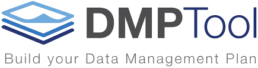

@snap[west]

<h1>Research Resources</h1>
<h3>For Data-Based Projects</h3>
@size[medium](David Durden, <i>Data Services Librarian</i>)

@snapend

---

<h3>Hi! I'm Dave.</h3>

@snap[south template-note text-gray]
Slides @ https://go.umd.edu/181015-dcc
@snap

Note: My name is David Durden; I'm the Data Services Librarian for the University Libraries. If you have ever interacted with a librarian here on campus (which you all should have, *right?*), chances are they were working in Reference. 

Unlike those librarians which you *should* have met, I work down in the basement of McKeldin Library. I deal primarily with digital curation, data archiving, and data management. 
 
--- 

### Roadmap

@ul

- Inspiration
- Strategy
- Resources 

@ulend 

@snap[south template-note text-gray]
Slides @ https://go.umd.edu/181015-dcc
@snap

Note: I'm going to briefly talk about refining research questions and generating search terms, and I'll introduce some places to start looking for resources as well as some entry-level data tools.

I do want to apologize in advance for any duplication in material presented here: I was asked to present loosely on the topic of research for data-based projects, so hopefully there is something of relevance for each of you throughout this presentation.

Let's get started.

---?image=template/img/bg/white.jpg&position=right&size=70% 100%
@title[Sidebar + Heading]

@snap[west text-white]
<h2>Q1</h2>
@snapend

@snap[east span-70]
<h2>@css[text-black](Who's doing what?)</h2>
@snapend

Note: One approach is to take a look at what various institutes and companies are currently doing in regard to design work (*even if they are at other Universities or in the public sector*)

---

### Inspiring Examples

@ul

- [Ideo](https://www.ideo.com/)
- [Y Combinator](https://blog.ycombinator.com/)
- [Design Incubation Centre](http://www.designincubationcentre.com/)
- [Library of Congress Labs](https://labs.loc.gov/)
- Relevant conferences?

@ulend

@snap[south template-note text-gray]
Slides @ https://go.umd.edu/181015-dcc
@snap

Note: 

Ideo is a company who pioneered in the field of design thinking. They emphasize human-centered design through collaboration, innovation, and creativity. *You may have heard of them.* The Ideo website features past projects, blogs that discuss approaches, successes, and failures, and some tools to get you started in design thinking. 

Y Combinator technically provides seed funding for start-ups. YC emphasizes technology, especially in Silicon Valley. However, the YC blog is a valuable resource for learning about the start-up mentality and being successful with technology. 

The Design Incubation Center is housed at the National University of Singapore. The DIC is a design research laboratory and the DIC website has a lot of creative focused research.

Conferences often publish their proceedings or make presentations/short-/long-papers available (*this is a great place to get the most current research and work in a given field*) Depending on what your project is, and what your personal field of study is, the conferences that may appeal to you is highly variable. If you don't know what conferences exist in your field, ask a professor sometime.

---

### Inspiring Examples at UMD

@ul

- [Maryland Institute for Technology in the Humanities (MITH)](https://mith.umd.edu/research/)
- [Human-Computer Interaction Laboratory](http://hcil.umd.edu/research-areas/)
- [238 campus research centers](https://www.umd.edu/centers-and-institutes)

@ulend

@snap[south template-note text-gray]
Slides @ https://go.umd.edu/181015-dcc
@snap

Note:

The University you are currently attending also has a wealth of cutting-edge research and most institutes and research centers across campus make their research available through their websites.

Two centers that I think are appropriate for the DCC would be MITH and HCIL -- both are physically located in Hornbake Library.

If these centers don't fit your idea, you can browse all 238 centers on campus at the link provided in the slides.

---?image=template/img/bg/white.jpg&position=right&size=70% 100%
@title[Sidebar + Heading]

@snap[west text-white]
<h2>Q2</h2>
@snapend

@snap[east span-70]
<h2>@css[text-black](How do I find relevant *stuff*?)</h2>
@snapend

---

### Strategize => Search => Refine

@ul 

- What are you really looking for?
- Dedicate time for random exploration
- Collect some ideas
- Discover some trends
- Expand your vocabulary

@ulend

@snap[south template-note text-gray]
Slides @ https://go.umd.edu/181015-dcc
@snap

Note: 

Take some time to develop a search strategy that works for you. Your experience will vary. 

1. Cast a wide net first and then refine, e.g., broad and shallow vs. narrow and deep.

2. Your initial search may be painfully unproductive. Avoid the urge to *pre-crastinate*.
 
3. Your initial ideas should be conceptual, theoretical, high-level. From these concepts you can drill-down and get specific. 

4. Look for and analyze thematic trends in seemingly disparate or unrelated topics. Trends can help you both decide what to do, and what *not* to do.

5. Reduce these themes and ideas into a set of core vocabulary terms--these will become your search keywords. Use a thesaurus to find word variants; use official thesauri to discover how different indexes and catalogs are organizing information.
6.  Use citation managers liek Zotero, Mendeley, EndNote (if you have a subscription), or BibTex (if you're into that sorta thing.)

+++ 

### Example Vocabularies

@ul
    
- [Library of Congress Subject Headings](http://id.loc.gov/authorities/subjects.html) @note[The LoC subject headings are how most library systems in the United States arrange and describe their holdings. There is a bit of a learning curve regarding how to best navigate this resource, but it can be valuable. ]
- [Getty Institute Vocabularies](http://www.getty.edu/research/tools/vocabularies/) @note[The Getty has developed several controlled vocabularies designed for the graphic arts and architecture. ]
- Articles and search results often include subject terms and keywords! @note[Whenever you find a relevant article in EBSCO or ProQuest, you will be able to see the search terms associated with the results. Keep track of these terms when collecting articles. Some publications, such as those published in the Association for Computing Machinery (ACM) format will usually include subject terms and keywords alongside the abstract.]

@ulend

---

### Wait, Wait, Wait! 

Don't let yourself explore too far.

@snap[south template-note text-gray]
[Relevant xkcd (well, sort of. It was *actually* published in *TIME*.)](https://timedotcom.files.wordpress.com/2015/11/munroe-2a.jpg?w=600)
@snapend

---

### Use References from Relevant Papers

@ul

- Works cited == more sources for you
- Search the works of a single author
- Look for annotated and/or [published bibliographies](http://www.oxfordbibliographies.com/)
- *HINT:* Ask your reference librarian to help you find relevant materials!

@ulend

@snap[south template-note text-gray]
Slides @ https://go.umd.edu/181015-dcc
@snap
    
Note: *Question to the group*: Has anyone ever gone down the Rabbit Hole on Wikipedia? Clicking link after link until you windup far from where you started? 

You can use the works cited and reference pages of things you read to lead you directly to other relevant resources. References are for more than fulfilling a submission requirement or complying with academic integrity standards.

---

### Document Your Adventure

@ul

- Keep a log of your searches

@ul

- Search terms
- Databases/platforms searched
- Relevant results
- Reusing data? [Cite it!](http://best-practices.dataverse.org/data-citation/)

@ulend
@ulend

@snap[south template-note text-gray]
[A nifty guide to keeping a lab notebook.](https://colinpurrington.com/tips/lab-notebooks)
@snap

Note: Documenting your work is probably the most difficult part of research. Ask yourself: *"If I were to revisit this project a year from now, will I be able to pick up where I left off?"*

Even if you aren't performing lab-based research, you can apply the organizational strategies of keeping a lab notebook (follow the link at the bottom of the slide for more info).

---

### Plan and Document with a Data Management Plan

Login at [https://dmptool.org]()

@snap[south template-note text-gray]
Disclaimer: I work in data management and I'm a little enthusiastic about DMPs.
@snap

Note: DMPTool is a website that hosts templates for various data management plans. While mostly aimed at researchers applying for funding from various grant awarding agencies, DMPs can be a useful tool for thinking through who will have access to your stuff, where your stuff comes from, where your stuff is stored, and where your stuff will live once you're finished with it.

---?image=template/img/bg/white.jpg&position=right&size=70% 100%
@title[Sidebar + Heading]

@snap[west text-white]
<h2>Q3</h2>
@snapend

@snap[east span-70]
<h2>@css[text-black](Where do I find relevant *stuff*?)</h2>
@snapend

---

### Know Where to Search

@ul

- [UMD Library Catalogue](https://umaryland.on.worldcat.org/advancedsearch)
- [The Digital Repository at the University of Maryland (DRUM)](https://www.drum.lib.umd.edu)
- Search specific indexes/databases/publishers

@ulend
    @ul

    - [Design & Applied Arts Index](https://search.proquest.com/daai/advanced?accountid=14696)
    - [ACM Digital Library](https://dl-acm-org.proxy-um.researchport.umd.edu/)
    - [Multidisciplinary Digital Publishing Institute](https://www.mdpi.com)

    @ulend
    
@snap[south template-note text-gray]
Slides @ https://go.umd.edu/181015-dcc
@snap

---

### Know Where to Search

@ul

- Search specific publications
- [The Harvard Business Review](http://web.b.ebscohost.com.proxy-um.researchport.umd.edu/ehost/command/detail?vid=0&sid=467fe51a-4259-4159-9302-aa3e8c2b43d7%40sessionmgr102&bdata=JnNpdGU9ZWhvc3QtbGl2ZQ%3d%3d#jid=HBR&db=bth)
- [The MIT Technology Review](https://search-proquest-com.proxy-um.researchport.umd.edu/publication/35850)
    
@ulend

@snap[south template-note text-gray]
Slides @ https://go.umd.edu/181015-dcc
@snap

---

### Know Where to Search

@ul

- [Google Scholar](https://www.scholar.google.com)
- TIP: Set up [Google Alerts](https://www.google.com/alerts) for awesome passive search results delivered right to your inbox.

@ulend

@snap[south template-note text-gray]
Slides @ https://go.umd.edu/181015-dcc
@snap

---

### Know How to Search

- Boolean operators (AND, NOT, OR)
- Boolean values (True/False)
- Platform specific search operators (e.g., Google, ProQuest, WorldCat)

@snap[south template-note text-gray]
[Relevant slides for advanced searching in Google](https://drdn.github.io/presentations/20180214-g-search-strategy.pdf)
@snap

---

### Wait, I'm Looking for Data!

@ul

- [Registry of Research Data Repositories](https://www.re3data.org) @note[re3data is a searchable registry of hosted datasets. The registry has an emphasis on research data, but this means that datasets discovered should also point to relevant research papers.]
- [data.gov](https://www.data.gov) @note[The U.S. Government's Open Data portal. A one-stop shop for data and data tools]
- [The National Data Service](https://www.nationaldataservice.org) @note[The NDS is a consortial effort to improve research data infrastructure in the U.S. This site provides tools, data, and exposes some of the projects supported by the NDS and the Research Data Alliance, which is an international organization aimed at improving the sharing and access to research data.]
- [wikidata.org](https://wikidata.org) @note[OK. Wikidata is really cool. Wikidata is a human-machine readable linked data platform powered by the Wikimedia Foundation. Through this website, you can generate datasets from sparql queries, or you can edit or add new items. Wikidata provides resources to make your underlying data better, but it is also a great place to get started working with data.]

@ulend

@snap[south template-note text-gray]
Slides @ https://go.umd.edu/181015-dcc
@snap

---

### No, I Need More Data!

@ul

- [FiveThirtyEight](https://data.fivethirtyeight.com/) @note[538 is a data analysis blog founded by Nate Silver (author of *The Signal and the Noise*). (*Without cheating,* does anyone know the relevance of the number 538? Answer: its the number of electors in the US Electoral College.) 538 makes all of the data used in its visualizations, predictions, and articles available for reuse through its github page.] 
- [Awesome Public Datasets](https://github.com/awesomedata/awesome-public-datasets) @note[This is a huge collection of public datasets arranged by topic. While public, not all of the datasets are free.]
- [Free Music Archive](http://freemusicarchive.org/) @note[An archive of free music. It's pretty sweet.]
- [UC Irvine Lachine Learning Library](http://archive.ics.uci.edu/ml/index.php) @note[A collection of machine learning ready datasets. If ML is your thing, this is a great collection of resources.]
- [Internet Archive](https://archive.org) @note[Not presented as a dataset, but can be used with various metadata harvesting methods to generate datasets. Python has a module for data mining the Internet Archive and the [Programming Historian](https://programminghistorian.org/en/lessons/data-mining-the-internet-archive) has a tutorial on how to use it.]

@ulend

@snap[south template-note text-gray]
Slides @ https://go.umd.edu/181015-dcc
@snap

---?image=template/img/bg/white.jpg&position=right&size=70% 100%
@title[Sidebar + Heading]

@snap[west text-white]
<h2>Q4</h2>
@snapend

@snap[east span-70]
<h2>@css[text-black](How do I keep myself from getting overwhelmed?)</h2>
@snapend

---

### This is My Life

Substitute *literally any website* for *news site*. 

@snap[south template-note text-gray]
[Relevant xkcd no.1411](https://imgs.xkcd.com/comics/loop.png)
@snapend

Note: Technology can be excruciatingly distracting. Don't trick yourself into procrastinating by learning or being 'productive'. Some examples of this are:

- cleaning your apartment/dorm/house to avoid work
- learning a cool, but irrelevant skill (e.g., the case of [Donald Knuth writing a book and inventing TeX](https://en.wikipedia.org/wiki/TeX#History) because he didn't like what his book looked like)

---

### Get to Know Yourself

[Pre-crastination](https://www.nytimes.com/2016/01/17/opinion/sunday/why-i-taught-myself-to-procrastinate.html) vs. procrastination.

Note: [pre-crastination](http://journals.sagepub.com/doi/abs/10.1177/0956797614532657) is referred to as the "hastening of subgoal completion at the expense of extra physical effort." 

@snap[south template-note text-gray]
Slides @ https://go.umd.edu/181015-dcc
@snap

---

@quote[Am I rushing to complete things, or am I avoiding doing things all together?]

Note: Ask yourself, *"do I rush to complete things or do I avoid doing them all together?*

---?image=template/img/bg/white.jpg&position=right&size=70% 100%
@title[Sidebar + Heading]

@snap[west text-white]
<h2>Q5</h2>
@snapend

@snap[east span-70]
<h2>@css[text-black](How do I manage all the stuff I found?)</h2>
@snapend

---

### Tools for Managing Research and Data

- [Jupyter Notebooks](https://www.datacamp.com/community/tutorials/tutorial-jupyter-notebook) @note[Jupyter Notebooks are an integrated environment for putting code, text, and graphics all in one place. This link will take you to a datacamp tutorial on setting up Jupyter in Python.]
- [OpenRefine](http://openrefine.org/) @note[OpenRefine is an excellent way to explore, clean, transform, and restructure data in a graphic interface. Granted, there are more technical ways to do a lot of way OpenRefine accomplishes (e.g., Python's Pandas Library or R). OpenRefine runs in a web browser and lets you interact with substantially more data than Excel (it also won't reformat or overwrite your existing data).]
- [Zotero](https://www.zotero.org/) @note[Zotero is a free tool for collecting and organizing citations and full-text research materials. If used correctly, you can organize by project, format citations, and have access to pdfs of collected research all in one place. Other options exist, such as EndNote and Mendeley.]
- Git and Github @note[Version control is your friend. However, Github is open and accessible to the entire web, so think about the possibility of having your work scooped before committing everything to GH. github does have a private repository option, but it comes with a monthly fee.]

@snap[south template-note text-gray]
Slides @ https://go.umd.edu/181015-dcc
@snap

---

## Questions?

---?color=white
@title[Thanks!]

@snap[west]
@css[contact-name](David Durden) 
@fa[twitter-square text-blue pad-right-icon]@css[twitter-handle text-blue](@davedrdn) 
@fa[github-square text-purple pad-right-icon]@css[git-handle text-purple](drdn) 
@fa[envelope-o pad-right-icon]@css[contact-email](durden@umd.edu)
@snapend

@snap[east]
<h3>Contact info</h3>
@snapend
